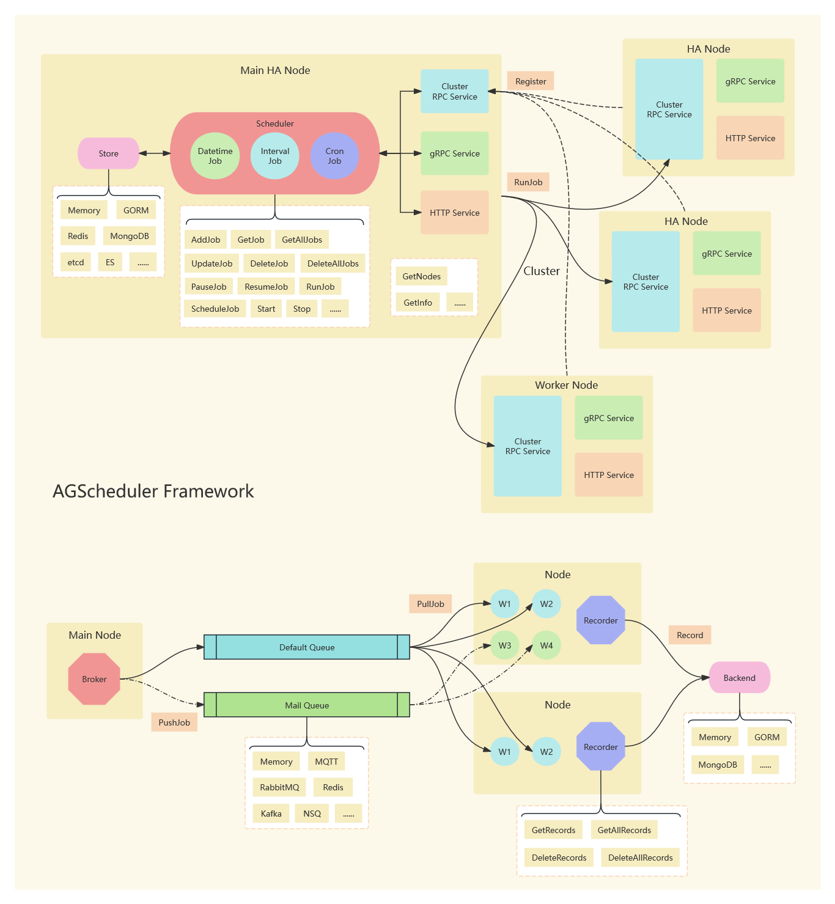

# AGScheduler

[](https://github.com/agscheduler/agscheduler/actions/workflows/test.yml)
[](https://codecov.io/gh/agscheduler/agscheduler)
[](https://goreportcard.com/report/github.com/agscheduler/agscheduler)
[](https://pkg.go.dev/github.com/agscheduler/agscheduler)


[](https://github.com/agscheduler/agscheduler/blob/main/LICENSE)

> Advanced Golang Scheduler (AGScheduler) 是一款适用于 Golang 的任务调度库，支持多种调度类型，支持动态更改和持久化作业，支持作业队列，支持作业结果回收，支持远程调用，支持集群

[English](README.md) | 简体中文

## 特性

- 支持三种调度类型
  - [x] 一次性执行
  - [x] 间隔执行
  - [x] Cron 式调度
- 支持多种作业存储方式
  - [x] Memory (不支持集群 HA 模式)
  - [x] [GORM](https://gorm.io/) (任何 GORM 支持的 RDBMS 都能运行)
  - [x] [Redis](https://redis.io/)
  - [x] [MongoDB](https://www.mongodb.com/)
  - [x] [etcd](https://etcd.io/)
  - [x] [Elasticsearch](https://www.elastic.co/elasticsearch)
- 支持多种作业队列
  - [x] Memory (不支持集群模式)
  - [x] [NSQ](https://nsq.io/)
  - [x] [RabbitMQ](https://www.rabbitmq.com/)
  - [x] [Redis](https://redis.io/)
  - [x] [MQTT](https://mqtt.org/) (不支持历史作业)
  - [x] [Kafka](https://kafka.apache.org/)
- 支持多种作业结果后端
  - [x] Memory (不支持集群模式)
  - [x] [GORM](https://gorm.io/) (任何 GORM 支持的 RDBMS 都能运行)
  - [x] [MongoDB](https://www.mongodb.com/)
- 支持远程调用
  - [x] [gRPC](https://grpc.io/)
  - [x] HTTP
- 支持集群
  - [x] 远程工作节点
  - [x] 调度器高可用 (实验性)

## 架构



## 安装

```bash
go get -u github.com/agscheduler/agscheduler
```

## 使用

```go
package main

import (
	"context"
	"fmt"
	"log/slog"
	"time"

	"github.com/agscheduler/agscheduler"
	"github.com/agscheduler/agscheduler/stores"
)

func printMsg(ctx context.Context, j agscheduler.Job) (result string) {
	slog.Info(fmt.Sprintf("Run job `%s` %s\n\n", j.FullName(), j.Args))
	return
}

func main() {
	agscheduler.RegisterFuncs(
		agscheduler.FuncPkg{Func: printMsg},
	)

	store := &stores.MemoryStore{}
	scheduler := &agscheduler.Scheduler{}
	scheduler.SetStore(store)

	job1 := agscheduler.Job{
		Name:     "Job1",
		Type:     agscheduler.JOB_TYPE_INTERVAL,
		Interval: "2s",
		Timezone: "UTC",
		Func:     printMsg,
		Args:     map[string]any{"arg1": "1", "arg2": "2", "arg3": "3"},
	}
	job1, _ = scheduler.AddJob(job1)
	slog.Info(fmt.Sprintf("%s.\n\n", job1))

	job2 := agscheduler.Job{
		Name:     "Job2",
		Type:     agscheduler.JOB_TYPE_CRON,
		CronExpr: "*/1 * * * *",
		Timezone: "Asia/Shanghai",
		FuncName: "main.printMsg",
		Args:     map[string]any{"arg4": "4", "arg5": "5", "arg6": "6", "arg7": "7"},
	}
	job2, _ = s.AddJob(job2)
	slog.Info(fmt.Sprintf("%s.\n\n", job2))

	job3 := agscheduler.Job{
		Name:     "Job3",
		Type:     agscheduler.JOB_TYPE_DATETIME,
		StartAt:  "2023-09-22 07:30:08",
		Timezone: "America/New_York",
		Func:     printMsg,
		Args:     map[string]any{"arg8": "8", "arg9": "9"},
	}
	job3, _ = s.AddJob(job3)
	slog.Info(fmt.Sprintf("%s.\n\n", job3))

	jobs, _ := s.GetAllJobs()
	slog.Info(fmt.Sprintf("Scheduler get all jobs %s.\n\n", jobs))

	scheduler.Start()

	select {}
}
```

## 注册函数

> **_由于 golang 无法序列化函数，所以 `scheduler.Start()` 之前需要使用 `RegisterFuncs` 注册函数_**

## 队列

```go
mq := &queues.MemoryQueue{}
brk := &agscheduler.Broker{
	Queues: map[string]agscheduler.QueuePkg{
		"default": {
			Queue:   mq,
			Workers: 2,
		},
	},
}

scheduler.SetStore(store)
scheduler.SetBroker(brk)
```

## 结果回收

```go
mb := &backends.MemoryBackend{}
rec := &agscheduler.Recorder{Backend: mb}

scheduler.SetStore(store)
scheduler.SetRecorder(rec)

job, _ = scheduler.AddJob(job)
records, _ := rec.GetRecords(job.Id)
```

## gRPC

```go
// Server
grservice := services.GRPCService{
	Scheduler: scheduler,
	Address:   "127.0.0.1:36360",
	// PasswordSha2: "xxxxxx",
}
grservice.Start()

// Client
conn, _ := grpc.NewClient("127.0.0.1:36360", grpc.WithTransportCredentials(insecure.NewCredentials()))
client := pb.NewSchedulerClient(conn)
client.AddJob(ctx, job)
```

## HTTP

```go
// Server
hservice := services.HTTPService{
	Scheduler: scheduler,
	Address:   "127.0.0.1:36370",
	// PasswordSha2: "xxxxxx",
}
hservice.Start()

// Client
mJob := map[string]any{...}
bJob, _ := json.Marshal(mJob)
resp, _ := http.Post("http://127.0.0.1:36370/scheduler/job", "application/json", bytes.NewReader(bJob))
```

## 集群

```go
// Main Node
cnMain := &agscheduler.ClusterNode{
	Endpoint:     "127.0.0.1:36380",
	EndpointGRPC: "127.0.0.1:36360",
	EndpointHTTP: "127.0.0.1:36370",
	Queue:        "default",
}
schedulerMain.SetStore(storeMain)
schedulerMain.SetClusterNode(ctx, cnMain)
cserviceMain := &services.ClusterService{Cn: cnMain}
cserviceMain.Start()

// Worker Node
cnNode := &agscheduler.ClusterNode{
	EndpointMain: "127.0.0.1:36380",
	Endpoint:     "127.0.0.1:36381",
	EndpointGRPC: "127.0.0.1:36361",
	EndpointHTTP: "127.0.0.1:36371",
	Queue:        "worker",
}
schedulerNode.SetStore(storeNode)
schedulerNode.SetClusterNode(ctx, cnNode)
cserviceNode := &services.ClusterService{Cn: cnNode}
cserviceNode.Start()
```

## 集群 HA (高可用，实验性)

```go
// HA 需要满足以下条件：
//
// 1. 集群中 HA 节点的数量必须为奇数
// 2. 所有 HA 节点都需要连接到同一个存储（不包含 MemoryStore）
// 3. ClusterNode 的 Mode 属性需要设置为 `HA`
// 4. HA 主节点必须先启动

// Main HA Node
cnMain := &agscheduler.ClusterNode{..., Mode: "HA"}

// HA Node
cnNode1 := &agscheduler.ClusterNode{..., Mode: "HA"}
cnNode2 := &agscheduler.ClusterNode{..., Mode: "HA"}

// Worker Node
cnNode3 := &agscheduler.ClusterNode{...}
```

## Base API

| gRPC Function | HTTP Method | HTTP Path                 |
|---------------|-------------|---------------------------|
| GetInfo       | GET         | /info                     |
| GetFuncs      | GET         | /funcs                    |

## Scheduler API

| gRPC Function | HTTP Method | HTTP Path                 |
|---------------|-------------|---------------------------|
| AddJob        | POST        | /scheduler/job            |
| GetJob        | GET         | /scheduler/job/:id        |
| GetAllJobs    | GET         | /scheduler/jobs           |
| UpdateJob     | PUT         | /scheduler/job            |
| DeleteJob     | DELETE      | /scheduler/job/:id        |
| DeleteAllJobs | DELETE      | /scheduler/jobs           |
| PauseJob      | POST        | /scheduler/job/:id/pause  |
| ResumeJob     | POST        | /scheduler/job/:id/resume |
| RunJob        | POST        | /scheduler/job/run        |
| ScheduleJob   | POST        | /scheduler/job/schedule   |
| Start         | POST        | /scheduler/start          |
| Stop          | POST        | /scheduler/stop           |

## Recorder API

| gRPC Function | HTTP Method | HTTP Path                 |
|---------------|-------------|---------------------------|
| GetRecords    | GET         | /recorder/records/:job_id |
| GetAllRecords | GET         | /recorder/records         |
| DeleteRecords | DELETE      | /recorder/records/:job_id |
| DeleteAllRecords | DELETE   | /recorder/records         |

## Cluster API

| gRPC Function | HTTP Method | HTTP Path                 |
|---------------|-------------|---------------------------|
| GetNodes      | GET         | /cluster/nodes            |

## 示例

[完整示例][examples]

## 开发

```bash
# 克隆代码
git clone git@github.com:agscheduler/agscheduler.git

# 工作目录
cd agscheduler

# 安装依赖
make install

# 启动 CI 服务
make up-ci-services

# 运行检查
make check-all
```

## [Cli](https://github.com/AGScheduler/agscheduler-cli)

```bash
cargo install agscheduler-cli
```

## [Web](https://github.com/AGScheduler/agscheduler-web)

```bash
docker run --rm -p 8080:80 ghcr.io/agscheduler/agscheduler-web:latest
```

## 致谢

[APScheduler](https://github.com/agronholm/apscheduler/tree/3.x)

[simple-raft](https://github.com/chapin666/simple-raft)

[examples]: https://github.com/agscheduler/agscheduler/tree/main/examples
